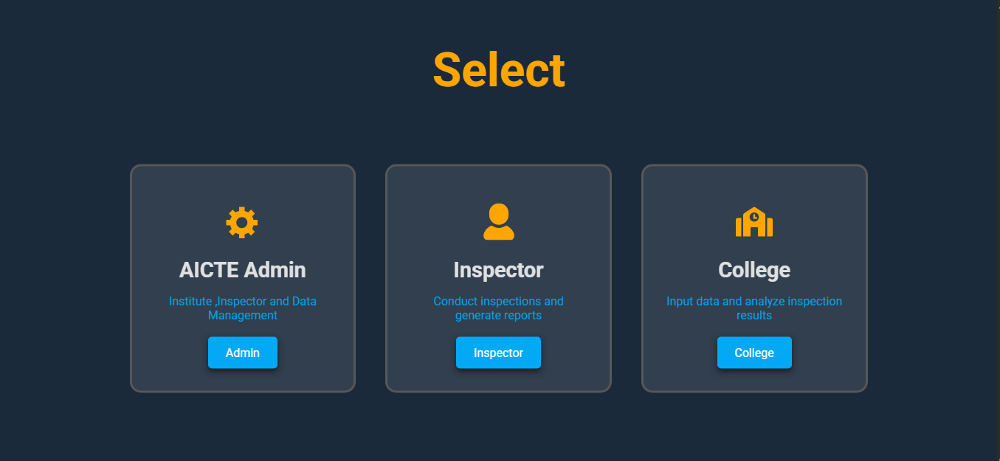
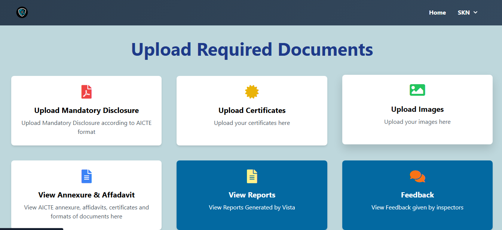
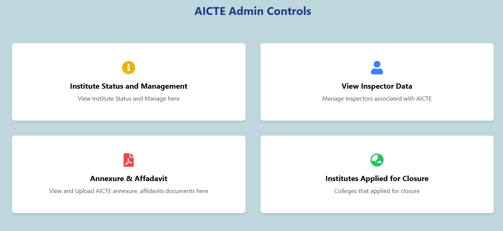

# 🛡️ VISTA - AI-Powered Institutional Inspection System

  

  <b>An AI-powered inspection platform that automates institutional compliance verification using Computer Vision, OCR, NLP, and Machine Learning.</b>

---

# 📖 Overview

VISTA is an AI-powered institutional inspection system developed to streamline the inspection process for educational institutions. The platform minimizes manual verification by automatically analyzing uploaded documents and infrastructure images, detecting anomalies, and generating intelligent inspection reports.

The system enables AICTE administrators, inspectors, and colleges to collaborate through a centralized platform that improves transparency, accuracy, and efficiency during institutional inspections.

---

# ✨ Key Features

- 📄 AI-powered document verification using OCR and TAPAS
- 🖼️ Infrastructure inspection using YOLOv8 and CNN
- ⚠️ Anomaly detection using Isolation Forest
- 📊 AI-generated inspection reports
- 🗺️ GIS-based regional visualization
- ☁️ Cloudinary integration for image storage
- 🔐 Role-based authentication (AICTE Admin, Inspector, College)
- 📈 Centralized inspection dashboard

---
# 💻 Tech Stack

## Frontend

- React.js
- JavaScript
- HTML5
- CSS3

## Backend

- FastAPI
- Django
- Python

## Database

- MongoDB

## AI & Machine Learning

- YOLOv8
- CNN
- OCR
- TAPAS
- Isolation Forest

## Cloud Services

- Cloudinary

## Tools

- Git
- GitHub
- VS Code
- Postman

---

# 📸 Screenshots

## 👥 Role Selection

---

## 🏫 College Dashboard

---

## 🛠️ AICTE Admin Dashboard

---

# 📊 User Modules

### 🏛️ AICTE Admin

- Manage Institutions
- Manage Inspectors
- View Annexures & Affidavits
- Review Closure Requests

### 👨‍💼 Inspector

- Conduct Inspections
- View Uploaded Documents
- Analyze Infrastructure Images
- Generate Inspection Reports

### 🏫 College

- Upload Mandatory Documents
- Upload Certificates
- Upload Infrastructure Images
- View generated Reports
- Review Inspector Feedback

# 👥 Team

- **Shrushti Kamate**
- **Soundarya Ekbote**
- **Vedashri Bijwar**
- **Priyanka Gulhane**
